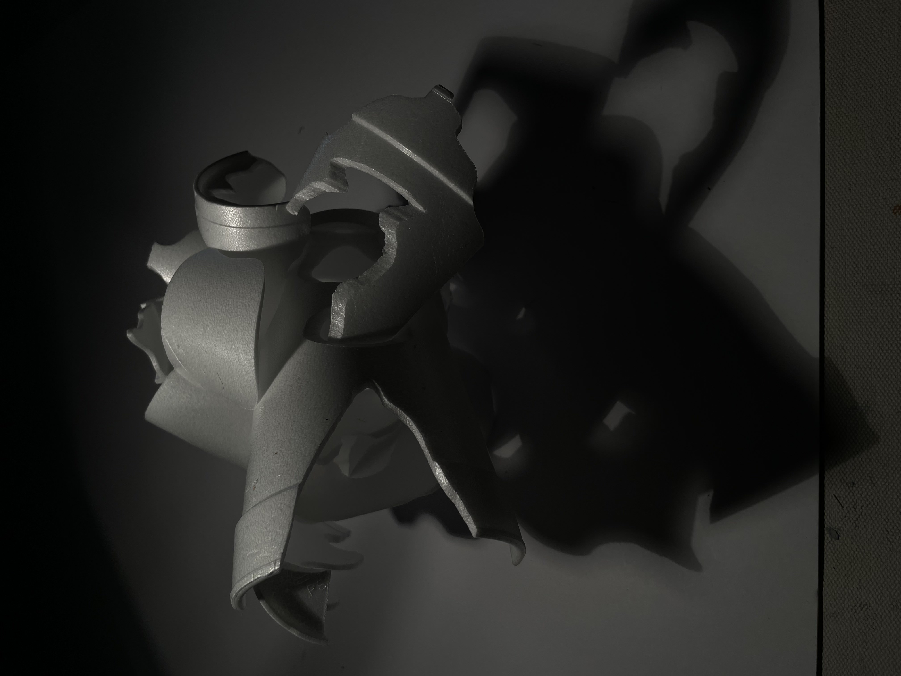
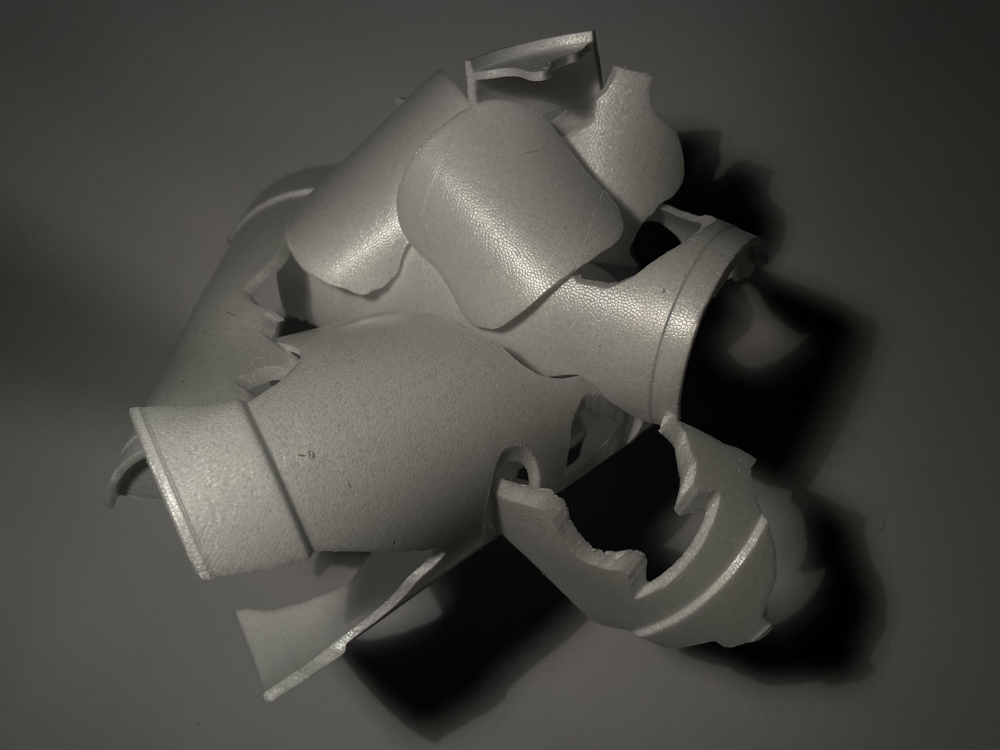
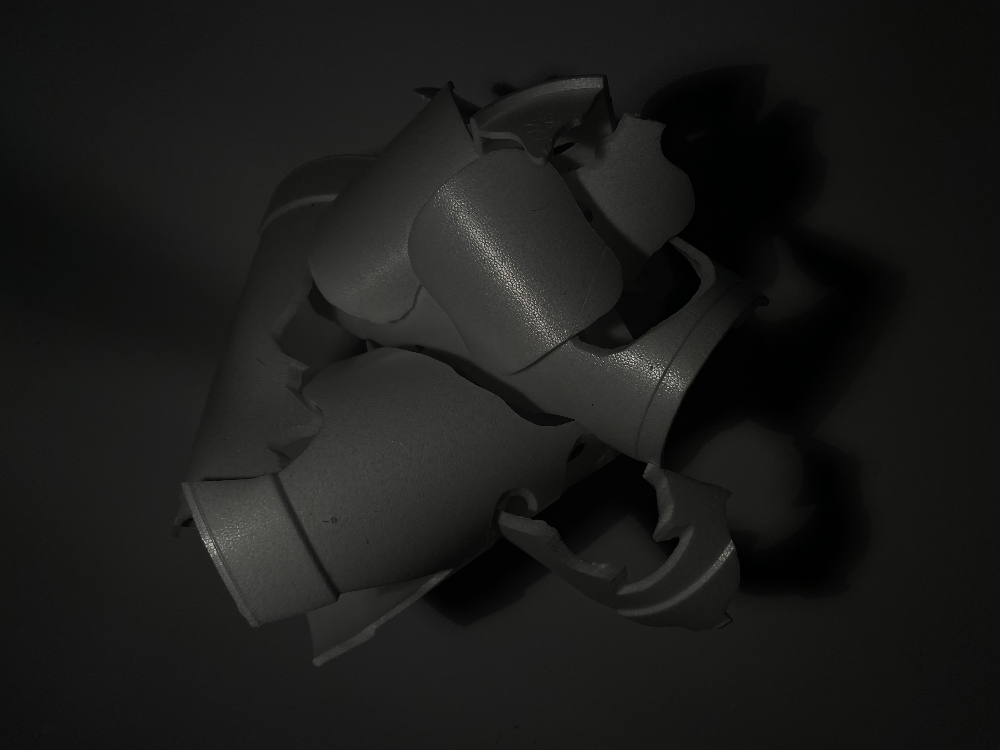
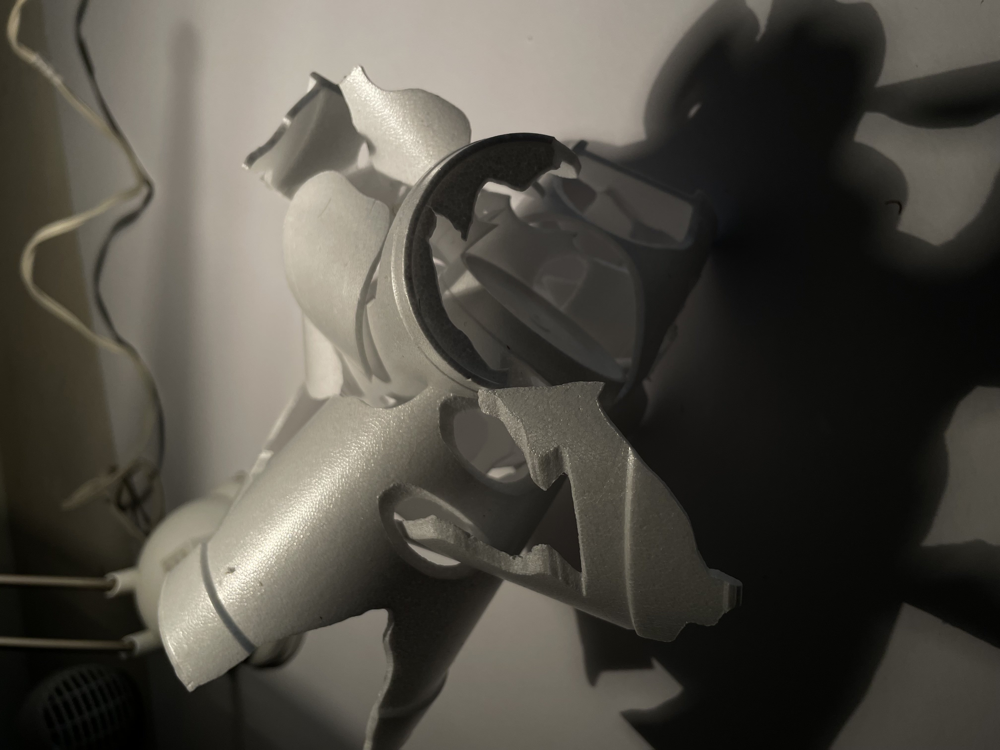
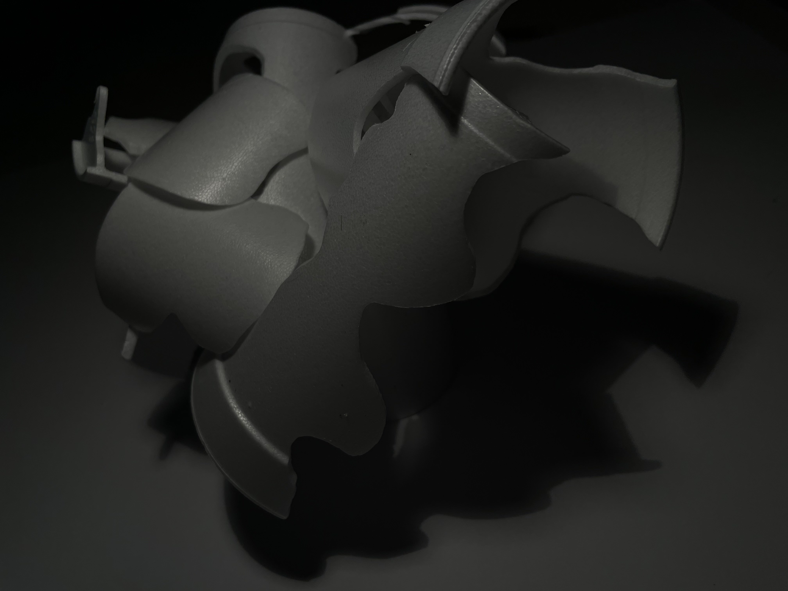
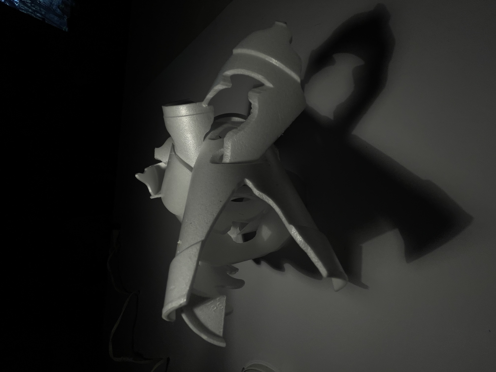

+++
title = "Art: Self-Supporting Foam Abstraction"
date = 2023-03-05
+++

Recently I had to create art from 3 foam cups. I found that the shapes I could create from them were not particularly interesting, even though there is a bunch of negative space in them. I could not really manipulate that third dimension of width because of how thin the cups are and the fidelity of my tools.
 
 
This project was super quick. Here are a few photos.
 
 
 
 

